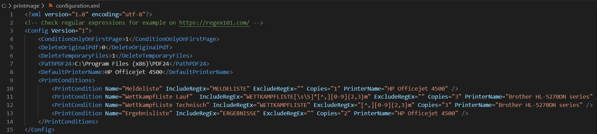
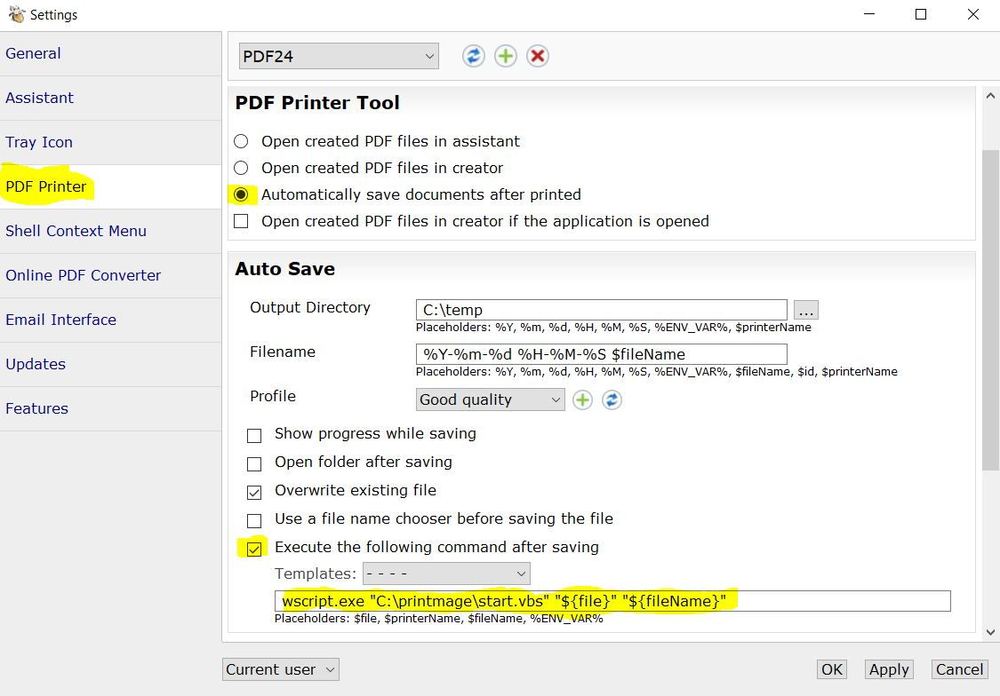

# PrintMage
PrintMage is a print distribution solution. Print jobs can be distributed to several printers depending on the document content. Also the number of copies can be changed. 

PrintMage leverages the free to use [PDF24 Creator](https://pdf24.org) and the pdf to text tool of [Xpdf tools](https://www.xpdfreader.com). The printer driver of PDF24 is used to create a pdf-document, then the document is analysed and processed and finally printed on configured printers.

The software is licensed under [GPL v3](https://www.gnu.org/licenses/gpl-3.0.html). Use the software at your own risk without any warranties. The author is not responsible for any issues, data losses or errors.  

## Quick installation guide
- Download and install [PDF24 Creator](https://pdf24.org)
- Download PrintMage-Release-ZIP and extract to a folder, e.g. `c:\printmage`
- Change settings in PDF24 (`C:\Program Files (x86)\PDF24\pdf24-Settings.exe`)
    - Set PDF Printer -> PDF Printer Tool -> "Automatically save documents after printed"
    - Set PDF Printer -> Auto Save -> "Execute the following command after Saving.  
    Enter: `wscript.exe "C:\printmage\start.vbs" "${file}" "${fileName}"`
- Adjust PrintMage configuration to your needs (`c:\printmage\configuration.xml`). If you want to print a number of copies unconditionally on certain printers just leave the RegEx fields empty. 

## Usage
Just use the PDF24 printer driver from your application. Tested with PDF24 Creator 9.0.1 and Xpdf 4.02.

## PrintMage configuration

#### ConditionOnlyOnFirstPage
Defines whether the text content analysis is performed only on the first page of the document or if is performed on the whole document. Often the decision can already be made with the content of the first page. Set to 0 to analyse whole document.

#### DeleteOriginalPdf
Defines whether the original pdf document created by the pdf24 driver is deleted after printing. To keep the pdfs for example for archiving purposes, set the value to 0.

#### DeleteTemporaryFiles
Defines whether temporary created files are deleted after printing. Usually should be set to 1. Set it to 0 for diagnose and troubleshooting.

#### PathPDF24
The path to the PDF24 installation directory. Change if PDF24 was not installed to the default directory.

#### DefaultPrinterName
If no print condition applies, the print job is executed on the printer with the default printer name.

#### PrintConditions
Define the print conditions. Each conditions including the printer on which to print (PrinterName), the number of printouts (Copies) and a name for the condition (Name). The condition itself is defined with two [regular expressions](https://en.wikipedia.org/wiki/Regular_expression). Both expressions need to evaluate to true to perform the printing. An empty condition, for example `IncludeRegEx=""`, always evaluates to true. So to always print and only define the number of printouts, set IncludeRegEx and ExcludeRegEx to "".    

## PDF24 configuration

- Change settings in PDF24 (`C:\Program Files (x86)\PDF24\pdf24-Settings.exe`)
    - Set PDF Printer -> PDF Printer Tool -> "Automatically save documents after printed"
    - Set PDF Printer -> Auto Save -> "Execute the following command after Saving.  
    Enter: `wscript.exe "C:\printmage\start.vbs" "${file}" "${fileName}"`

## Troubleshooting:
- You need at least Windows 7 SP1
- Content based print distribution is only possible if the document contains font based text. If the print-document consists only of rendered images, no text extraction is possible.
- Use at least powershell version 3. Check version: `powershell -Command "$PSVersionTable.PSVersion.Major"`. [Download](https://www.microsoft.com/en-us/download/details.aspx?id=54616) version 5.1.
- Check log.txt
- Set DeleteTemporaryFiles to 0 and examine files.
